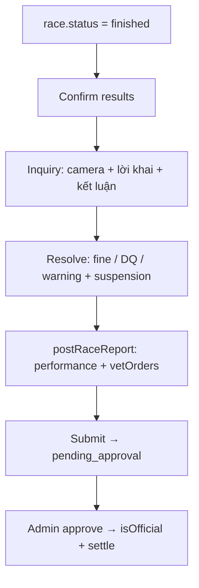

# Hướng dẫn Post-race Reports (Approach A)

> **Ngày:** 2026-08-01  
> **Project:** HRTMS-AI (G07)  
> **Spec gốc:** `docs/superpowers/specs/2026-08-01-post-race-reports-design.md`  
> **File này:** gom **flow + schema + API + code chính** của phần Post-race mới.

---

## 1. Mục đích

Sau khi race `finished`, trọng tài lập phần cốt lõi Stewards' Report:

| Mục | Nội dung | Effect |
|-----|----------|--------|
| **Inquiries** | Lời khai, góc camera, kết luận lỗi | Gắn trên `incident` |
| **Performance Explanations** | Favorite / chạy tệ → triệu tập jockey/owner | Documentary |
| **Post-race Vet Orders** | Lệnh máu / nước tiểu / nội soi / lâm sàng | Documentary (không lab thật) |
| **Penalties** | fine / DQ / warning + `reasonCode` + treo giò | Fine → `PenaltyTicket`; DQ → re-rank; treo → `suspendedUntil` |

Payout Official **không đổi**: chỉ khi Admin **approve** biên bản.

---

## 2. Flow tổng thể

```
PRE-RACE                    IN-RACE                 POST-RACE (PHẦN MỚI)
────────                    ───────                 ──────────────────
pre_check                   running                 finished (provisional)
Pass/Fail + Late Scratch    Live Flag → draft       1. Confirm results
auto Pre-race Report          incident              2. Inquiry trên Flag
                                                    3. Resolve (verdict + treo)
                                                    4. postRaceReport
                                                       (performance + vet)
                                                    5. Submit (hết draft)
                                                    6. Admin approve
                                                       → Official + purse/bet
```



### Thứ tự thao tác Referee (UI)

1. Tab **Kết Quả** → xác nhận kết quả tạm thời  
2. Tab **Báo Cáo** → Sửa báo cáo  
3. Incidents có `draft` → nút **Inquiry / Resolve**  
4. Section **Post-race — Performance / Vet Orders** → thêm dòng  
5. **Lưu** → **Nộp** (bắt buộc Track Condition + hết draft)  
6. Admin duyệt → Official

---

## 3. File đã đụng (map nhanh)

| Layer | Path |
|-------|------|
| Spec | `docs/superpowers/specs/2026-08-01-post-race-reports-design.md` |
| Constants | `backend/src/config/constants.js` |
| Model report | `backend/src/models/referee_report.model.js` |
| Model user | `backend/src/models/user.model.js` (`jockeyProfile.suspendedUntil`) |
| Suspension helper | `backend/src/services/jockey-suspension.helper.js` |
| Business logic | `backend/src/services/referee.service.js` |
| Guards | `registration.service.js`, `jockey_invitation.service.js` |
| Routes | `backend/src/routes/referee.routes.js` |
| Controller | `backend/src/controllers/referee.controller.js` |
| FE API | `frontend/src/app/api/referee.ts` |
| FE UI | `frontend/src/app/pages/RefereeDashboard.tsx` |
| FE hint | `frontend/src/app/pages/referee/ResultsConfirmPanel.tsx` |
| Jockey banner | `frontend/src/app/pages/JockeyDashboard.tsx` |

---

## 4. Constants

```js
// backend/src/config/constants.js
const INQUIRY_STATEMENT_ROLES = ['jockey', 'owner', 'witness'];
const INQUIRY_FAULT_PARTIES = ['subject', 'other', 'both', 'none'];
const PENALTY_REASON_CODES = ['interference', 'whip', 'careless', 'late', 'other'];
const POST_RACE_VET_ORDER_TYPES = ['blood', 'urine', 'endoscopy', 'clinical'];
const INQUIRY_CAMERA_ANGLES = ['Head-on', 'Side', 'Tower', 'Replay', 'Other'];
```

---

## 5. Data model (code)

### 5.1 `postRaceReport` + `inquiry` trên incident

Nguồn: `backend/src/models/referee_report.model.js`

```js
const performanceExplanationSchema = new mongoose.Schema(
  {
    registrationId: { type: mongoose.Schema.Types.ObjectId, ref: 'Registration', required: true },
    horseId: { type: mongoose.Schema.Types.ObjectId, ref: 'Horse', required: true },
    label: { type: String, trim: true, required: true },
    summonedRoles: {
      type: [{ type: String, enum: ['jockey', 'owner'] }],
      default: [],
    },
    explanation: { type: String, trim: true, default: '' },
    recordedAt: { type: Date, default: Date.now },
  },
  { _id: true },
);

const vetOrderSchema = new mongoose.Schema(
  {
    registrationId: { type: mongoose.Schema.Types.ObjectId, ref: 'Registration', required: true },
    horseId: { type: mongoose.Schema.Types.ObjectId, ref: 'Horse', required: true },
    label: { type: String, trim: true, required: true },
    orderType: {
      type: String,
      enum: POST_RACE_VET_ORDER_TYPES,
      required: true,
    },
    note: { type: String, trim: true, default: '' },
    orderedAt: { type: Date, default: Date.now },
  },
  { _id: true },
);

const postRaceReportSchema = new mongoose.Schema(
  {
    performanceExplanations: { type: [performanceExplanationSchema], default: [] },
    vetOrders: { type: [vetOrderSchema], default: [] },
  },
  { _id: false },
);

// Trên incidentSchema:
inquiry: {
  statements: [{ role, name, text }],  // jockey|owner|witness
  cameraAngles: [String],
  faultParty: 'subject'|'other'|'both'|'none'|null,
  conclusion: String,
},
resolution: {
  verdict: 'none'|'warning'|'fine'|'disqualified',
  fineAmount, fineTargetRole, fineTargetUserId,
  reasonCode: 'interference'|'whip'|'careless'|'late'|'other'|null,
  suspensionDays: Number|null,
  note, resolvedAt,
},

// Trên RefereeReport:
postRaceReport: { type: postRaceReportSchema, default: () => ({}) },
```

### 5.2 Treo giò jockey

```js
// backend/src/models/user.model.js — jockeyProfile
suspendedUntil: { type: Date, default: null },
```

---

## 6. API

| Method | Path | Body chính | Ghi chú |
|--------|------|------------|---------|
| `PATCH` | `/api/referee/reports/:id` | `{ postRaceReport: { performanceExplanations, vetOrders } }` | Replace arrays |
| `PATCH` | `/api/referee/reports/:id/incidents/:incidentId` | `{ inquiry?, type?, description?, action? }` | Lưu inquiry draft |
| `PATCH` | `/api/referee/reports/:id/incidents/:incidentId/resolve` | `{ inquiry?, resolution: { verdict, reasonCode, suspensionDays, fine* } }` | Kết án + effect |
| `POST` | `/api/referee/reports/:id/submit` | — | 400 nếu còn `status: draft` |
| `GET` | `/api/referee/reports/:id/pdf` | — | In Post-race + Inquiry + Penalty |

### Ví dụ body Resolve

```json
{
  "inquiry": {
    "cameraAngles": ["Head-on", "Side"],
    "faultParty": "subject",
    "conclusion": "Ép làn đoạn cuối — lỗi subject",
    "statements": [
      { "role": "jockey", "name": "Nguyen A Van", "text": "Ngựa bị ngạt thở" },
      { "role": "owner", "name": "Owner X", "text": "Đồng ý với kết luận steward" }
    ]
  },
  "resolution": {
    "verdict": "fine",
    "fineAmount": 200,
    "fineTargetRole": "jockey",
    "reasonCode": "whip",
    "suspensionDays": 3,
    "note": "Lạm dụng roi lần 2"
  }
}
```

### Ví dụ body Post-race

```json
{
  "postRaceReport": {
    "performanceExplanations": [
      {
        "registrationId": "...",
        "horseId": "...",
        "label": "TM Opera O",
        "summonedRoles": ["jockey", "owner"],
        "explanation": "Không thích nghi mặt đường Soft"
      }
    ],
    "vetOrders": [
      {
        "registrationId": "...",
        "horseId": "...",
        "label": "TM Opera O",
        "orderType": "endoscopy",
        "note": "Nghi tụ máu họng"
      }
    ]
  }
}
```

---

## 7. Business logic (code chính)

### 7.1 Suspension helper — full file

Nguồn: `backend/src/services/jockey-suspension.helper.js`

```js
const { User } = require('../models/user.model');
const { AppError } = require('../middleware/error.middleware');

function isJockeySuspended(jockeyDoc) {
  const until = jockeyDoc?.jockeyProfile?.suspendedUntil;
  if (!until) return false;
  return new Date(until).getTime() > Date.now();
}

async function assertJockeyNotSuspended(jockeyId) {
  const jockey = await User.findOne({ _id: jockeyId, role: 'jockey' }).select('fullName jockeyProfile');
  if (!jockey) throw new AppError(404, 'Không tìm thấy kỵ sĩ');
  if (isJockeySuspended(jockey)) {
    const until = new Date(jockey.jockeyProfile.suspendedUntil).toLocaleString('vi-VN');
    throw new AppError(400, `Kỵ sĩ đang bị treo giò đến ${until}`);
  }
  return jockey;
}

async function applyJockeySuspension(jockeyId, suspensionDays) {
  const days = Number(suspensionDays);
  if (!Number.isFinite(days) || days <= 0) return null;

  const jockey = await User.findOne({ _id: jockeyId, role: 'jockey' });
  if (!jockey) throw new AppError(404, 'Không tìm thấy kỵ sĩ để treo giò');

  if (!jockey.jockeyProfile) jockey.jockeyProfile = {};
  const candidate = new Date(Date.now() + days * 24 * 60 * 60 * 1000);
  const existing = jockey.jockeyProfile.suspendedUntil
    ? new Date(jockey.jockeyProfile.suspendedUntil)
    : null;
  const next = existing && existing > candidate ? existing : candidate;
  jockey.jockeyProfile.suspendedUntil = next;
  jockey.markModified('jockeyProfile');
  await jockey.save();
  return next;
}

module.exports = {
  isJockeySuspended,
  assertJockeyNotSuspended,
  applyJockeySuspension,
};
```

**Gọi guard tại:**

- `jockey_invitation.service.js` → `acceptInvitation`
- `registration.service.js` → `registerHorse` (nếu có `jockeyId`), `assignJockey`

### 7.2 Update / Resolve incident

Nguồn: `backend/src/services/referee.service.js`

```js
function applyInquiryFields(incident, inquiry) {
  if (!incident.inquiry) {
    incident.inquiry = { statements: [], cameraAngles: [], faultParty: null, conclusion: '' };
  }
  if (inquiry.statements !== undefined) incident.inquiry.statements = inquiry.statements;
  if (inquiry.cameraAngles !== undefined) incident.inquiry.cameraAngles = inquiry.cameraAngles;
  if (inquiry.faultParty !== undefined) incident.inquiry.faultParty = inquiry.faultParty;
  if (inquiry.conclusion !== undefined) incident.inquiry.conclusion = inquiry.conclusion;
}

// resolveIncident (tóm tắt effect):
// 1. Lưu inquiry + resolution (reasonCode, suspensionDays)
// 2. verdict=fine → createFineTicket + optional applyJockeySuspension
// 3. verdict=disqualified → RaceResult.disqualified=true + rebuildOfficialOrder
// 4. suspensionDays>0 (non-fine) → applyJockeySuspension(reg.jockeyId)
```

### 7.3 Submit gate

```js
const unresolved = (report.incidents || []).filter((i) => i.status === 'draft');
if (unresolved.length > 0) {
  throw new AppError(400, `Còn ${unresolved.length} sự cố draft chưa resolve — không thể nộp báo cáo`);
}
// + vẫn require trackCondition (pre-race)
```

### 7.4 Routes mới / mở rộng

```js
// PATCH inquiry
router.patch(
  '/reports/:id/incidents/:incidentId',
  authorize('referee'),
  validate(updateIncidentSchema),
  refereeController.updateIncident,
);

// PATCH resolve (đã có, schema mở rộng inquiry + reasonCode + suspensionDays)
router.patch(
  '/reports/:id/incidents/:incidentId/resolve',
  authorize('referee'),
  validate(resolveIncidentSchema),
  refereeController.resolveIncident,
);

// PATCH report: updateReportSchema cho phép postRaceReport
```

---

## 8. Frontend

### 8.1 Types / API client

File: `frontend/src/app/api/referee.ts`

- Types: `IncidentInquiry`, `PerformanceExplanation`, `VetOrder`, `PostRaceReport`, `PenaltyReasonCode`, …
- Methods: `updateIncident`, `resolveIncident` (body mở rộng), `updateReport` với `postRaceReport`

### 8.2 UI Referee

File: `frontend/src/app/pages/RefereeDashboard.tsx`

| UI | Hành vi |
|----|---------|
| Edit report → **Post-race — Performance** | Chọn ngựa, tick jockey/owner, nhập giải trình → Thêm |
| Edit report → **Post-race — Vet Orders** | Chọn ngựa + loại lệnh + note → Thêm |
| **Inquiry / Resolve** dialog | Camera chips, fault party, lời khai, verdict, reason, treo giò, fine |
| **Nộp** | Client + server chặn nếu còn draft |

### 8.3 Jockey banner treo giò

File: `frontend/src/app/pages/JockeyDashboard.tsx` (tab Tổng Quan)

```tsx
{(() => {
  const until = user?.jockeyProfile?.suspendedUntil;
  if (!until || new Date(until).getTime() <= Date.now()) return null;
  return (
    <div className="mb-6 border border-red-300 bg-red-50 px-4 py-3 text-sm text-red-800">
      <strong>Đang bị treo giò steward</strong>
      {' '}đến {new Date(until).toLocaleString('vi-VN')}.
      Không thể nhận lời mời / được gán race mới trong thời gian này.
    </div>
  );
})()}
```

---

## 9. Liên kết với flow cũ (không đổi)

| Cơ chế cũ | Vẫn đúng |
|-----------|----------|
| Live Flag → `incident.status = draft` | Có |
| Confirm results | Chỉ set `resultsConfirmedAt` |
| Fine → `PenaltyTicket` | Có |
| DQ → re-rank provisional | Có |
| Admin approve → `settleOfficialPayouts` | Có |
| Pre-race Report / Track Condition | Vẫn bắt buộc lúc submit |

---

## 10. Out of scope

- Lab doping / kết quả xét nghiệm thật  
- Upload video camera  
- Auto-detect favorite underperformance  
- Undo treo giò sau khi Admin đã approve  
- Đổi race status machine / đổi thời điểm payout  

---

## 11. Checklist test nhanh

1. Race `running` → Flag 1 ngựa → `finished`  
2. Confirm results  
3. Mở báo cáo → Inquiry/Resolve: camera + lời khai + fine + `suspensionDays: 3`  
4. Thêm Performance + Vet order → Lưu  
5. Nộp khi còn draft → lỗi; resolve hết → nộp OK  
6. Jockey bị treo: accept invitation → 400; overview hiện banner  
7. Admin approve → Official + tiền/cược settle  
8. PDF có section POST-RACE + Inquiry/Penalty  

---

**MAINTAINED FOR:** Group G07 — SE1823  
**LAST UPDATED:** 2026-08-01
